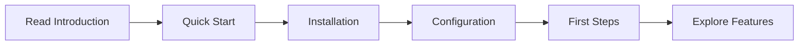

# Introduction

## Welcome! 👋

Welcome to DreamOS—a revolutionary learning platform that makes studying feel like playing your favorite video game. If you've ever felt unmotivated to study, struggled to organize your learning materials, or couldn't see the connections between what you're learning, DreamOS is built for you.

## The DreamOS Philosophy

### Learning Should Be Addictive

We believe learning should trigger the same dopamine responses as gaming. That's why we built a comprehensive XP system, achievement badges, and streak counters. Every action you take earns rewards, making you **want** to study rather than forcing yourself.

### AI Should Adapt to You

Your learning patterns are unique. DreamOS doesn't force you into rigid schedules—it analyzes your exam dates, topic priorities, past performance, and energy levels to create personalized daily plans that actually work for your life.

### Honesty > Perfection

Most learning platforms show you what you **should** be doing. DreamOS shows you what you're **actually** doing. Watch gaming videos? They show up in your knowledge graph. Have 50 unwatched educational videos? You'll see your "shame stats." This brutal honesty is what drives real change.

### Visual Learning Works

Reading lists of topics is boring. Seeing a living, breathing force-directed graph of your knowledge—with nodes pushing and pulling based on relationships—is mesmerizing. Visual feedback makes abstract learning concrete.

## Core Concepts

### 1. The Learning Loop

```
Watch Content → Earn XP → Build Knowledge Graph → Schedule Revision → Maintain Streak → Level Up
```

Every action feeds into the next, creating a self-reinforcing loop that makes studying habitual.

### 2. Multi-Source Learning

DreamOS doesn't care where you learn:
- YouTube videos
- Manual topic addition
- Luna AI conversations
- Wolfram Alpha queries

Everything gets integrated into your knowledge graph.

### 3. Spaced Repetition by AI

Based on exam dates and forgetting curves, the AI schedules your revisions:
- **R1**: Initial learning (Day 0)
- **R2**: First revision (Day 7-10)
- **R3**: Second revision (Day 20-25)

No more forgetting what you studied last month.

### 4. Real-Time Awareness

The signature red "YOU ARE HERE" line on your schedule isn't just pretty—it's a game-changer for ADHD learners. Always know where you are in your day.

## What Makes DreamOS Different?

| Feature | Traditional Apps | DreamOS |
|---------|-----------------|---------|
| **Motivation** | External (deadlines, grades) | Internal (XP, achievements, streaks) |
| **Scheduling** | Static calendar | AI-adaptive based on patterns |
| **Content** | Siloed (videos separate from notes) | Unified knowledge graph |
| **Analytics** | Filtered (shows ideal behavior) | Honest (shows actual behavior) |
| **Visualization** | Lists and tables | Force-directed graphs |
| **Learning Mode** | One-size-fits-all | Adaptive (Chat, Study Buddy, Quiz Master) |

## The Science Behind It

### Gamification Psychology

- **Variable Rewards**: XP amounts vary, triggering dopamine release
- **Progress Visualization**: XP bars provide clear feedback loops
- **Social Proof**: Achievement badges signal accomplishment
- **Loss Aversion**: Streaks make you not want to break chains

### Spaced Repetition

Based on Ebbinghaus's Forgetting Curve, DreamOS schedules revisions at optimal intervals to maximize retention.

### Visual Learning Theory

Dual Coding Theory (Paivio, 1971) shows that visual and verbal information processed together improves recall. Knowledge graphs leverage this.

### Adaptive Learning

Machine learning analyzes your patterns:
- Topics you struggle with get more time
- Your peak performance hours get priority tasks
- Exam proximity increases topic urgency

## Use Cases

### Scenario 1: The Procrastinating Student

**Problem**: You have 5 subjects, 3 exams in 2 weeks, and you've been watching YouTube videos instead of studying.

**Solution**:
1. Import all your saved YouTube videos (Watch Later)
2. DreamOS calculates "shame stats" (47 unwatched, 23 hours)
3. AI generates schedule prioritizing urgent topics
4. Gamification makes you want to clear the queue
5. Knowledge graph shows what you're actually interested in

**Result**: Study sessions become guilt-free, and you can see real progress.

### Scenario 2: The ADHD Learner

**Problem**: You lose track of time, forget what you were supposed to do, and struggle with long-term planning.

**Solution**:
1. Real-time schedule indicator shows exactly where you are
2. Break tasks into 30-90 minute chunks
3. Instant XP rewards provide dopamine hits
4. Visual knowledge graph keeps you engaged
5. Streak system creates external accountability

**Result**: Time management becomes visual and rewarding.

### Scenario 3: The Self-Taught Developer

**Problem**: You're learning React, Python, and algorithms from YouTube but can't see how it all connects.

**Solution**:
1. Import programming tutorial playlists
2. Birdseye graph shows connections (React → JavaScript, Algorithms → Python)
3. Filter by subject to focus (e.g., only show frontend topics)
4. Luna AI explains concepts when stuck
5. Wolfram validates technical topics

**Result**: Clear learning path emerges from chaos.

## Getting Started Path



1. **You are here** ✓ (Reading Introduction)
2. Next: [Quick Start](quick-start.md) (10-minute overview)
3. Then: [Installation](installation.md) (Setup guide)
4. After: [Configuration](configuration.md) (API keys)
5. Finally: [First Steps](first-steps.md) (Your first session)

## Ready to Begin?

Let's get you set up! Head to the [Quick Start](quick-start.md) guide to see DreamOS in action in under 10 minutes.


[quick-start.md](quick-start.md)

